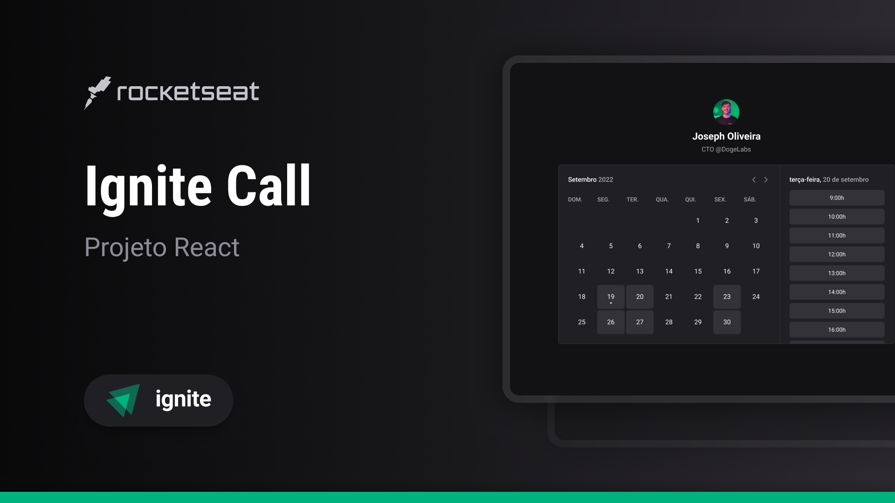

Aplicação desenvolvida como desafio da trilha Ignite da [RockeatSeat](https://rocketseat.com.br/?utm_source=aluno&utm_medium=germano-ricardi&utm_campaign=dev_fullstack).

Veja a aplicação em produção:
[https://germanoricardi.github.io/rocketseat-ignite-005-design-system](https://germanoricardi.github.io/rocketseat-ignite-005-design-system)

## Descrição  

Criado o Design System para uma aplicação chamada Ignite Call e documentando os componentes React com o Storybook.

Durante a criação do Design System foram aplicados:
*   Documentação no Storybook
*   Deploy automatizado com GitHub Actions
*   Monorepo
*   Publicação de pacotes em [www.npmjs.com](https://www.npmjs.com)

# Componentes do Design System

- [x] Avatar
- [x] Button
- [x] Checkbox
- [x] Heading
- [x] MultiStep
- [x] Text
- [x] Textarea
- [x] TextInput
- [x] Toast
- [x] Tooltip

## Tecnologias utilizadas

* [x] [NodeJS](https://nodejs.org/en)
* [x] [React](https://reactjs.org)
* [x] [Yarn](https://yarnpkg.com)
* [x] [NextJS](https://nextjs.org)
* [x] [TypeScript](https://www.typescriptlang.org)
* [x] [Radix UI](https://www.radix-ui.com/)
* [x] [Radix UI](https://www.radix-ui.com/)
* [x] [Storybook](https://storybook.js.org/)
* [x] [Github Actions](https://github.com/features/actions)

## Quickstart
Clone o repositório:
```sh
$  git clone https://github.com/germanoricardi/rocketseat-ignite-005-design-system
```
Para executar a aplicação utilize os seguintes comandos na raiz da aplicação:
```sh
$  yarn install
$  yarn dev
```
